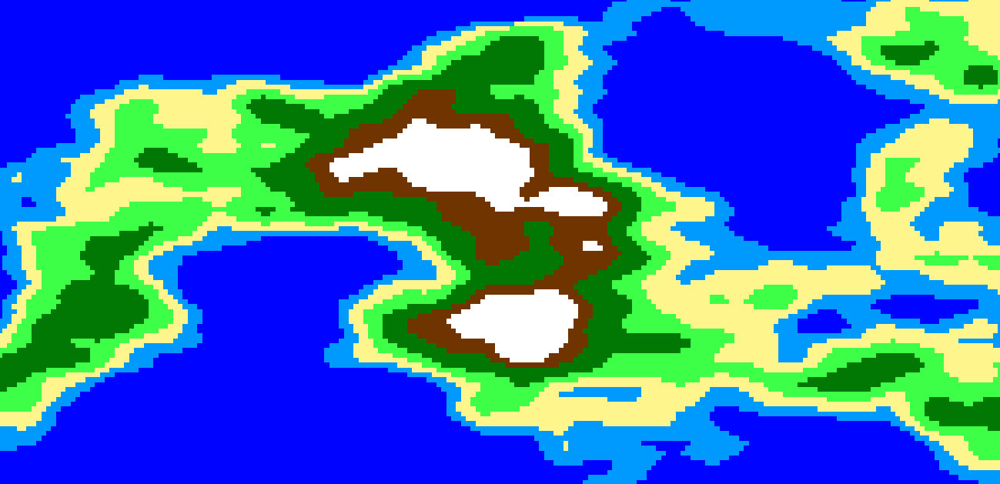

This past weekend I was working on a nice continent/island tile generator for a city-builder or possible 4X game, but don't know if I'll keep working on it.

It follows [Sebastian Lague's Landmass Generation tutorial](https://www.youtube.com/watch?v=wbpMiKiSKm8), but use's Unity new entity system. After I got most of the generation working, I added [RedBlobGames's Terrain from Noise article](https://www.redblobgames.com/maps/terrain-from-noise/#islands) to force it into usable land-contained areas that would work in a civ style game. I will be uploading the Unity project to my github in the next couple days, probably, and will link it here when it is up.